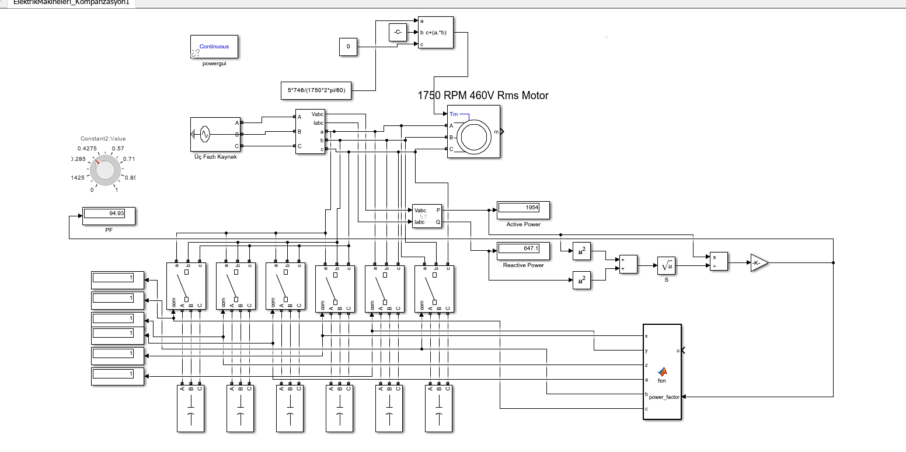

# Automatic Power Factor Compensation System

> This project focuses on the design and simulation of an automated power factor correction system for a three-phase asynchronous motor using delta-connected switched capacitor banks.
 
> ⚠️ **Compatibility Note:** Due to the deprecation and removal of specific Specialized Power Systems blocks in newer MATLAB releases (2025 and 2026), this Simulink model is strictly compatible only with **MATLAB 2024b and earlier versions**.

---

## Phase 1: System Architecture & Simulation

The primary objective of this project is to improve the energy efficiency of industrial inductive loads by dynamically compensating for reactive power. A **1750 RPM, 460 V star-connected asynchronous motor** was modeled in MATLAB/Simulink as the primary inductive load. The star connection provides the advantage of a lower starting current and efficient high-voltage operation.

To correct the resulting power factor (PF), a compensation panel consisting of six independent **delta-connected** capacitor banks was integrated into the system. The delta configuration was specifically chosen as it allows each phase to operate independently, maximizing the reactive power compensation capacity. The system continuously measures Active Power (P) and Reactive Power (Q) to dynamically monitor the real-time power factor.

<p align="center">
  
  <br>
  <em><b>Figure 1:</b> The complete MATLAB/Simulink architecture of the automatic power factor compensation system.</em>
</p>

## Phase 2: Dynamic Control Logic

A custom MATLAB Function block acts as the "brain" of the relay system. It dynamically switches the six capacitor banks (x, y, z, a, b, c) on or off based on the real-time power factor. 

The logic is designed to maintain the PF within an optimal hysteresis band (90% to 98%):
* **If PF < 90:** The system sequentially activates capacitor banks to inject reactive power.
* **If PF > 98:** The system sequentially deactivates capacitor banks to prevent over-compensation.
* **If 90 ≤ PF ≤ 98:** The system maintains the current capacitor states to prevent relay oscillation (chattering).

Below is the core control algorithm implemented in the simulation:

```matlab
function [x, y, z, a, b, c] = fcn(u, power_factor)
    % Inputs:
    % u: Unused input
    % power_factor: Current power factor
    % Outputs:
    % x, y, z, a, b, c: Capacitor relay states (1: Closed/On, 0: Open/Off)

    % Persistent variables to maintain capacitor states between steps
    persistent x_state y_state z_state a_state b_state c_state prev_power_factor;
    
    if isempty(x_state)
        % Initial state: All capacitors disconnected
        x_state = 0; y_state = 0; z_state = 0;
        a_state = 0; b_state = 0; c_state = 0;
        prev_power_factor = 0; 
    end
    
    % Update outputs with current states
    x = x_state; y = y_state; z = z_state;
    a = a_state; b = b_state; c = c_state;

    % If PF > 98, sequentially disconnect capacitors to prevent over-compensation
    if power_factor > 98
        if c_state == 1
            c_state = 0; 
        elseif b_state == 1
            b_state = 0; 
        elseif a_state == 1
            a_state = 0; 
        elseif z_state == 1
            z_state = 0; 
        elseif y_state == 1
            y_state = 0; 
        elseif x_state == 1
            x_state = 0; 
        end
        prev_power_factor = power_factor; 
        return;
    end

    % If PF < 90, sequentially connect capacitors to inject reactive power
    if power_factor < 90
        if x_state == 0
            x_state = 1; 
        elseif y_state == 0
            y_state = 1; 
        elseif z_state == 0
            z_state = 1; 
        elseif a_state == 0
            a_state = 1; 
        elseif b_state == 0
            b_state = 1; 
        elseif c_state == 0
            c_state = 1; 
        end
    end

    % If 90 <= PF <= 98, states are inherently maintained (hysteresis band)

    % Update previous power factor memory
    prev_power_factor = power_factor;
end
